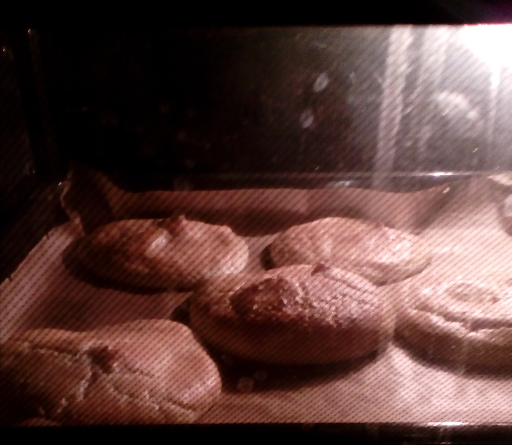

Oopsies sind kleine Fladenbrote, die vor allem aus Frischkäse und Eiern bestehen, ohne Mehl und Zucker auskommen und sich deshalb für Low-Carb-Rezepte als Beilage eignen.

## Zutaten für ~ 5-6 kleine Brote
- 3     Eier
- 1 TL  Salz
- ½ TL  Backpulver
- 100g  Frischkäse
- ½ EL  Flohsamenschalen
- evtl. noch etwas Mandelmehl

## Zubereitung
Backofen auf 150 ℃  vorheizen und ein Bleck mit Backpapier auslegen.

Die Eier trennen und das Eiweiß mit Salz und Backpulver steif schlagen. Eigelb, Flohsamenschalen und Frischkäse verrühren und alles vorsichtig unter das Eiweiß heben, bis ein gleichmäßiger Teig entsteht.

Den Teig in 6 kleinen Portionen auf dem Backpapier verteilen und 30 Minuten backen.

Mit weiteren Zutaten lassen sich die Oopsies variieren:

- Naan-Brot:    Knoblauchzehe schälen, auspressen und mit in den Teig geben und vor dem Backen mit schwarzem Kümmel bestreuen
- Zimt-Brot:    1 EL Mandelmehl, 2 TL Zimt, 1 TL Kardamom und 2 TL Kokosblütenzucker mit in den Teig geben.
- Himbeer-Brot: 1 EL Kokosraspel, 1 TL Vanillepulver, 1 TL Kardamom, 2 TL Kokosblütenzucker und 80 g aufgetaute Himbeeren unter den Teig mischen.
- Sesam-Brot:   1 EL Sesammehl unter den Teig rühren und mit etwas Sesam bestreuen.

