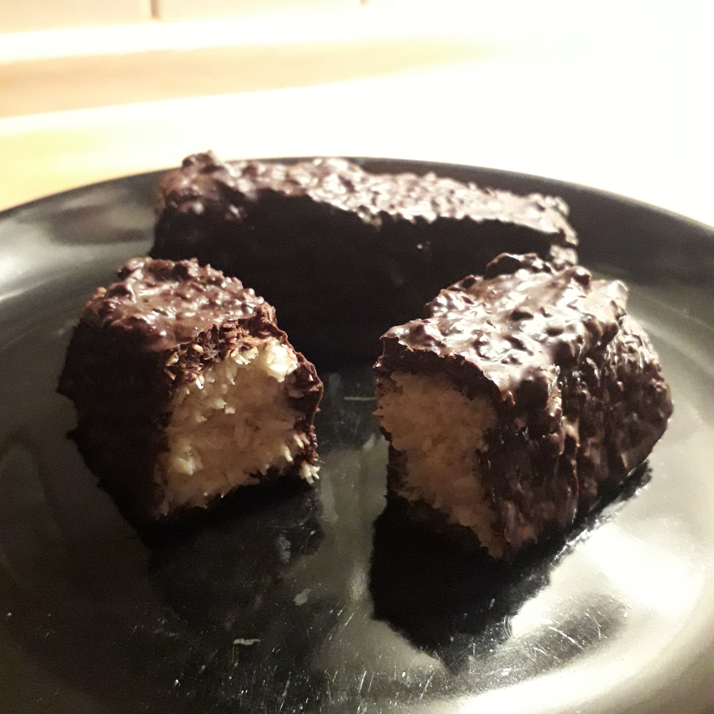

## Zutaten
- 1 Dose    Kokosmilch (400 ml)
- 3 EL      Kokosöl
- 2 EL      Kokosblütenzucker
- 150 g     Kokosraspel
- 200 g     dunkle Schokolade (> 80% Kakaoanteil)

## Zubereitung
Die Kokosmilch einige Stunden im Kühlschrank lagern, damit sich die Creme vom Kokoswasser absetzt. Das Kokoswasser weggießen oder für etwas anderes verwenden.

Die Kokoscreme mit 2 EL Kokosöl in einem Topf schmelzen, dann den Kokosblütenzucker und die Kokosraspel hinzufügen und alles zu einer gleichmäßigen Masse verrühren.

Eine Kastenform mit Frischhaltefolie auslegen und die Kokosmasse hineinfüllen und gut andrücken. Etwa 3 Stunden in den Kühlschrank stellen, bis die Masse vollständig geworden ist.

Danach vorsichtig aus der Kastenform nehmen und mit einem scharfen Messer in Riegel schneiden.

Die Schokolade mit dem verbliebenen EL Kokosöl im Wasserbad schmelzen und die Kokosriegel mithilfe von zwei Gabeln vorsichtig in die geschmolzene Schokolade tauchen und auf einen großen Teller mit Backpapier legen und anschließend im Kühlschrank abkühlen lassen.

