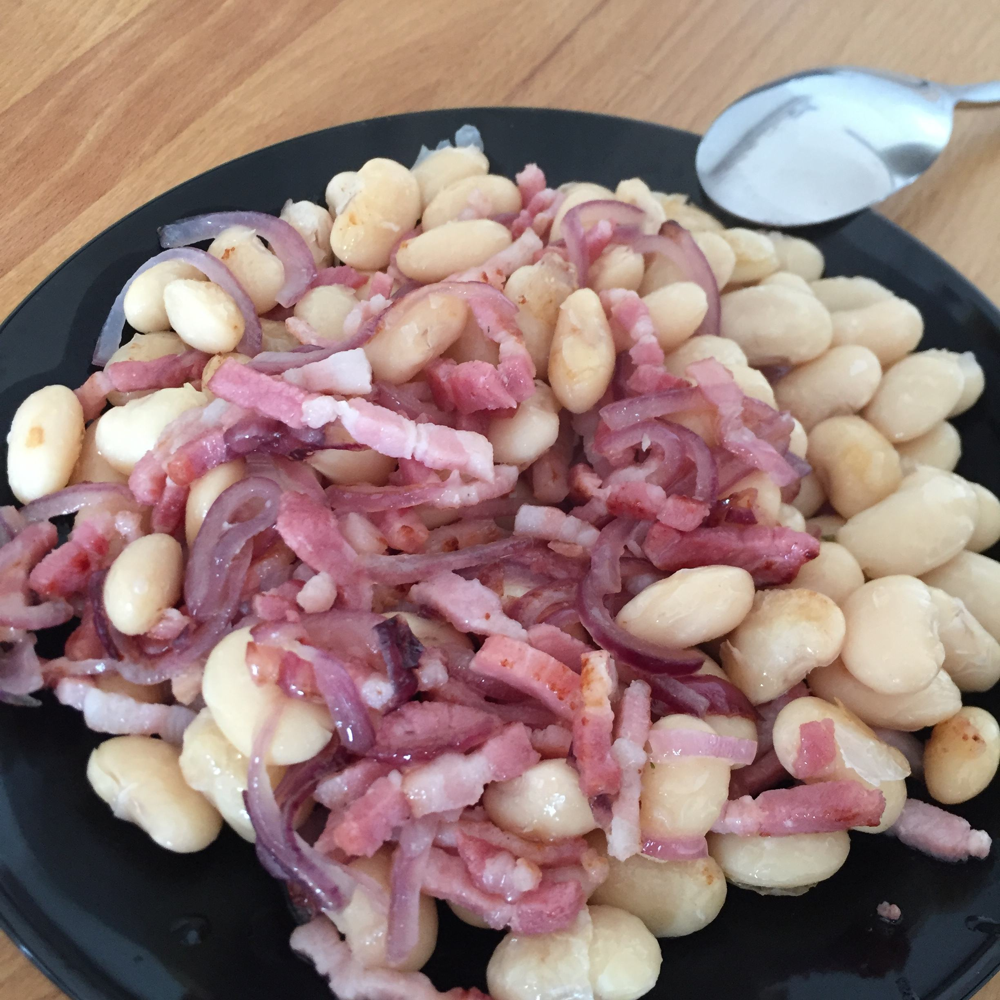

## Zutaten
- 1/2 Zwiebel
- 1 Dose Chili-Bohnen oder ein halbes Glas Dicke Bohnen
- Speckwürfel oder Bacon-Streifen

## Zubereitung
Die Zwiebel in Halbringe schneiden und zusammen mit den Speckwürfeln in einer Pfanne anbraten, bis die Zwiebeln glasig sind. Dann die Bohnen dazugeben und kurz durchbraten.
