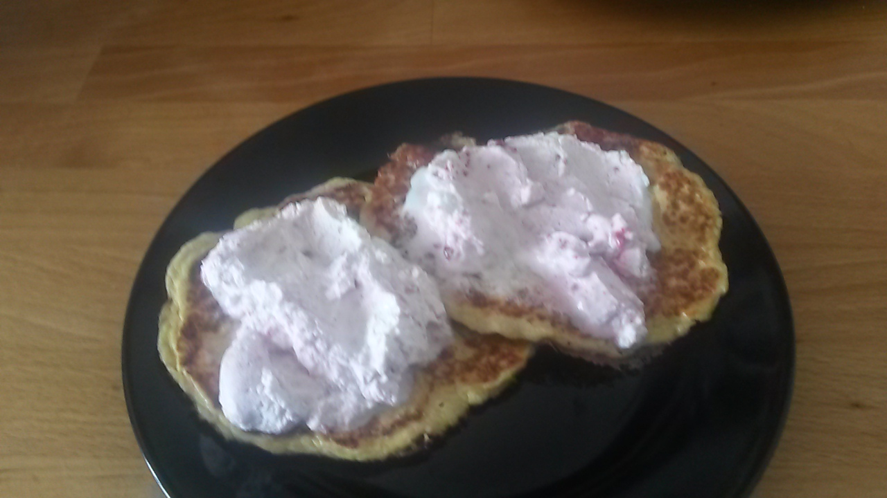

## Zutaten

### Pfannkuchen (ca. 6 Stück)
- 4     Eier
- 250 g Hüttenkäse (körniger Frischkäse)
- 2 EL  Flohsamenschalen
- 1 EL  Kokoszucker
- 1 TL  gemahlener Kardamom
- Abrieb von 1 Zitronenschale
- Kokosöl oder Butter zum Braten

### Beerenmousse
- 50 g  Himbeeren oder andere dunkle Beeren
- ½ TL  Vanillepulver
- 200 g Sahne
- etwas Süßstoff nach Bedarf

## Zubereitung

Für die Beerenmousse die Beeren zusammen mit der Vanille in einem kleinen Topf kurz aufkochen so dass die Beeren weich werden und wieder abkühlen lassen. Die Sahne steif schlagen und die Beerenmasse unterheben.

Für die Pfannkuchen Eier und Hüttenkäse mit einem Pürierstab durchmixen, bis sich die Brocken des Hüttenkäses aufgelöst haben. Die anderen Zutaten hinzufügen und nochmal durchmischen.
Butter oder Kokosöl in einer beschichteten Pfanne erhitzen und aus der Masse nacheinander Pfannkuchen braten. Immer mal wieder mit Butter oder dem Öl nachfetten. Mit dem Wenden warten, bis die Pfannkuchen eine gute Konsistenz erreicht haben, was je nach Dicke etwas dauern kann.

