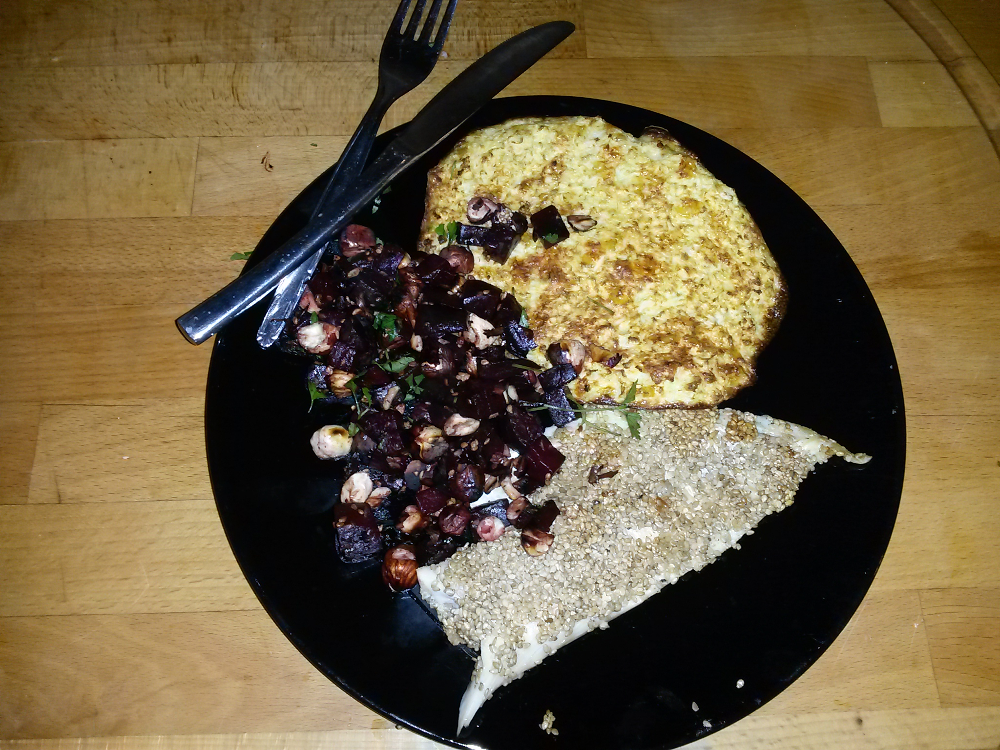

## Zutaten für 4 Personen
- 650 g Schollenfilets
- Zwei eier
- 150 g sesam
- salz und pfeffer
- Butter oder Kokosöl zum braten
- 500 g blumenkohl reis
- Eine zwiebel
- Zwei eier
- 100 g Reibekäse
- Ein EL Flohsamenschalen
- 400 g rote beete
- 100 g Haselnusskerne haselnuss kerne
- 50 Milliliter Balsamico
- Ein stengel glattblättrige petersilie

## Zubereitung
Zuerst für die rösti den backofen auf 200 Grad vorheizen. Ein Backblech mit Backpapier auslegen. Den blumenkohl reis mit zwiebeln, eiern, geriebenen käse und Flohsamenschalen verrühren. Den Rösti teig in kleinen Häuschen auf das backpapier legen und diese zu Fladen pressen. Im Backofen 20 Minuten backen, bis sie goldbraun sind.

Für die Fischfilets die eier in einem tiefen Teller schlagen und verquirlen , den sesam auf einem zweiten teller geben .
Die Schollenfilets abspülen, trocken tupfen und mit Salz und Pfeffer würzen. Zunächst in einer und dann in Sesam wälzen. Die panierten schollen bei Seite liegen.
In einer Pfanne reichlich Butter oder Kokosöl erhitzen und die schollen bei mittlerer Temperatur von beiden Seiten braten. Dabei gelegentlich kontrollieren, damit der sesam nicht verbrennt.

Die Roten Beete schälen und klein würfeln. Die haselnüsse grob hacken und in einer pfanne ohne Fett rösten. Beiseite stellen.
Eine Pfanne erhitzen, die Butter zerlassen und die rote beete Würfel mit dem Balsamico etwa 10 Minuten köcheln lassen, bis der Essig eingekocht ist und die rote beete bissfest sind.
Die gerösteten Haselnüsse über die rote beete streuen und mit Petersilie garnieren. Die Schollenfilets und die blumenkohl rösti dazu servieren.
