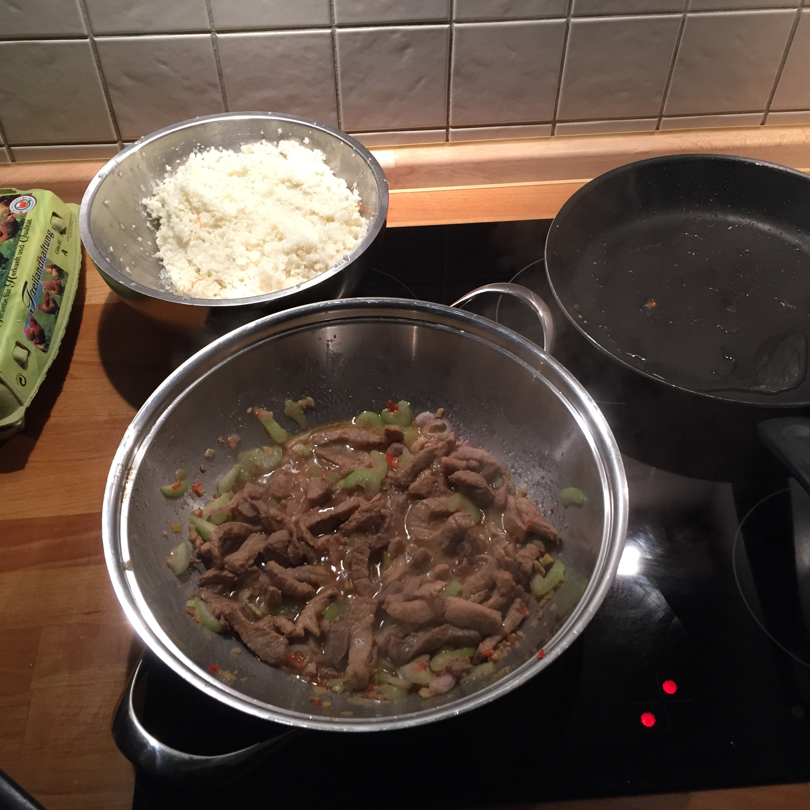
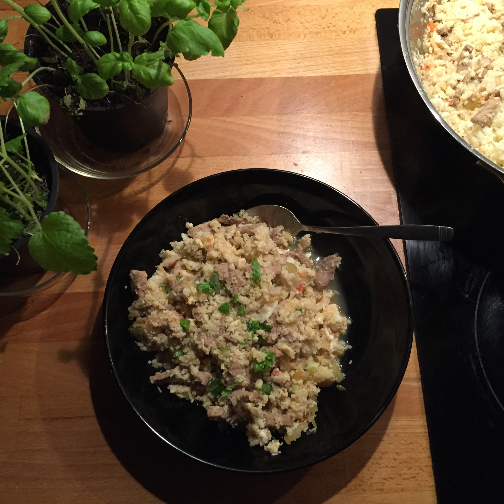

## Zutaten für 2 Portionen
- 600 g     Schweinefleisch
- 3 EL      Hühnerbrühe
- 2 EL      Fischsauce
- 3 EL      Tamari (glutenfreie Sojasauce)
- 5         Knoblauchzehen
- 1 EL      Limettensaft
- 1 TL      Kokosblütenzucker

- 1         Chilischote
- 4         Frülingszwiebeln
- 1 Stange  Staudensellerie
- 2 cm      Ingwer
- 2         Eier
- 500 g     [Blumenkohlreis](../beilagen/Blumenkohlreis.html)
- Kokosöl zum Braten

## Zubereitung
Das Schweinefleisch in Würfel schneiden, den Knoblauch pellen und klein hacken. Die Hühnerbrühe, Fischsauce, 2 EL Tamari, ⅖  der Knoblauchzehen, den Limettensaft und den Kokosblütenzucker zu einer Marinate vermischen. Das Schweinefleisch darin wenden und ziehen lassen.

Die Chilischote fein hacken, die Frülingszwiebeln und den Staudensellerie wachen und kleinschneiden, den Ingwer kleinreiben. Kokosöl in einer Pfanne oder Wok erhitzen und den restlichen Knoblauch, Chili und Ingwer kurz anbraten. Das Schweinefleisch und die Marinade hinzufügen und ca. 10 Minuten braten. Dann die Frülingszwiebeln und Sellerie unterrühren, 1 EL Tamari hinzugeben und das Ganze einige Minuten köcheln lassen.

Kokosöl in einer weiteren Pfanne erhitzen, die Eier hineinschlagen, den [Blumenkohlreis](../beilagen/Blumenkohlreis.html) hinzugeben und alles gut umrühren. Dann den Blumenkohlreis zu dem Fleisch geben und alles noch mal durchmischen.

## Nährwerte pro Portion
- kcal:  1137
- KH:      19g
- Fett:    11g
- EW:      23g

