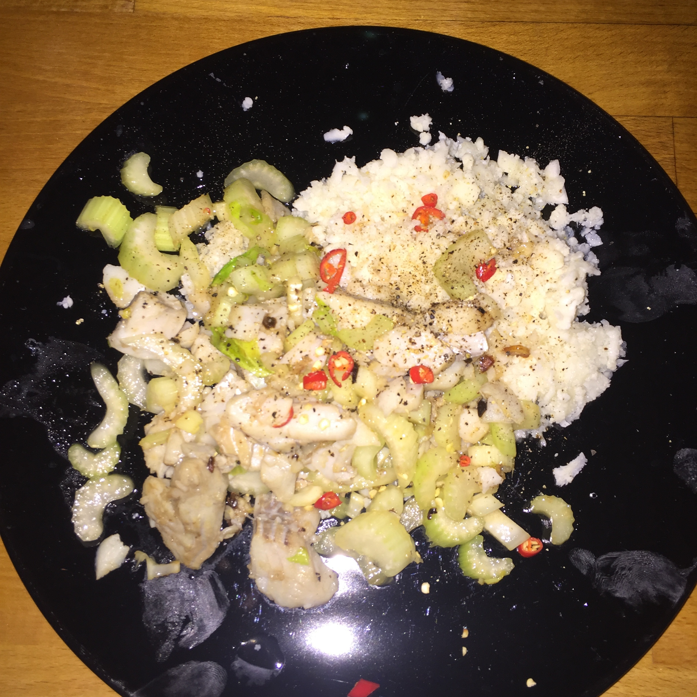

Das hier ist ein einfaches Gericht für Fischfiletes mit Strangensellerie (Pad Plah Keun Chai) - dazu passt [Blumenkohlreis](../beilagen/Blumenkohlreis.html) sehr gut.

## Zutaten für 2 Portionen
- 1 		Knoblauchzehe
- 1 		rote Chilischote
- 2   		Stängel Frühlingszwiebeln
- 2 		Stängel Sellerie
- 3 EL 		Öl, (Erdnuss- oder Sojaöl)
- 250 g 	Rotbarschfilet(s), Wels-, Kabeljau oder Seelachs-
- 2 EL 		Austernsauce
- 2 EL 		Fischsauce
- 2 EL 		Wasser
- 1 TL 		Kokosblütenzucker
-  etwas Pfeffer

## Zubereitung

Die Knoblauchzehe pellen und kleinhacken, die Chilischote und Frühlingszwiebeln in Ringe schneiden. Den Sellerie abwaschen, die Blätter abzupfen und grob hacken, die Stangen in Ringe schneiden.

Das Öl in einem Wok erhitzen und den Fisch in breitere Streifen schneiden. Den Fisch von beiden Seiten im Wok ca. 5 Min. bei mittlere Hitze braten. Dabei immer mal wieder den Wok leicht schütteln und einmal vorsichtig umdrehen. Die Fischstücke herausnehmen und schon mal auf Tellern anrichten.

Austernsauce, Fischsauce, Kokosblütenzucker und Wasser vermischen.

Bei großer Hitze den Knoblauch in dem restlichen Öl frittieren und dann den Sellerie hinzugeben und ca. 30 Sekunden im Wok schwenken. Dann mit der Sauce ablöschen und über dem Fisch verteilen.

Die grob gehackten Sellerieblätter, die Chiliringe und Frühlingszwiebel-Röllchen darüber verteilen und evtl. mit Pfeffer nachwürzen.
