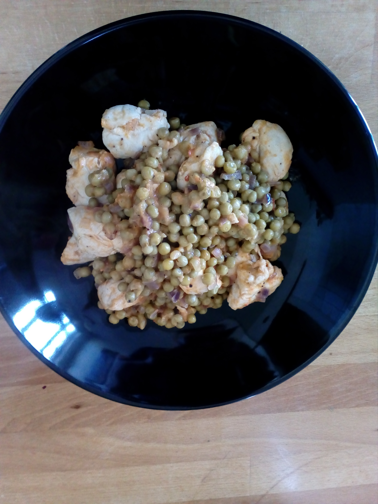

## Zutaten
- 500g Hänchenschnitzel oder Hänchenbrust
- 1 EL Ajvar, möglichst dickflüssig
- 1 gGrosse Zwiebel
- 1 Dose Erbsen (375g)
- Salz & Pfeffer

## Zubereitung
Die Zwiebeln schälen und in kleine Würfel hacken. Dann in einer Pfanne anbraten und leicht salzen. Das Hähnchen in kleine Stücke schneiden, mit in die Pfanne geben und mitbraten. Dann eine Packung oder eine Dose Erbsen mit rein, noch mal salzen und pfeffern.

Ca. 10 Minuten auf mittlerer Stufe weiterbraten, dann den Ajvar dazugeben, Herd ausmachen, Deckel drauf und 10 Minuten ziehen lassen.
