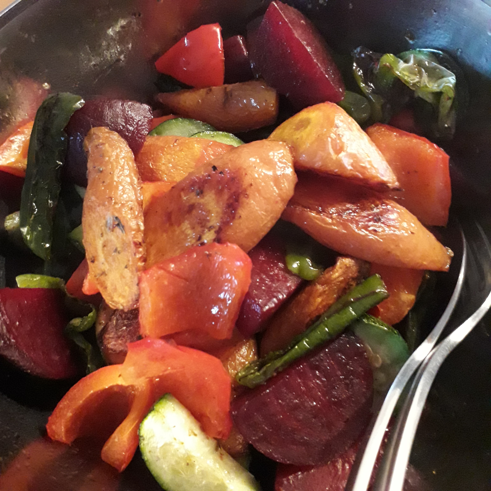

## Zutaten
So ziemlich alle möglichen Gemüsesorten eignen sich. Obligatorisch sind neben dem Gemüse eigentlich nur Öl, Salz & Pfeffer.

## Zubereitung
Ofengemüse lässt sich super auf einem mit Backpapier ausgelegtem Blech zubreiten. Im Prinzip müssen die verschiedenen Gemüsesorten nur geputzt und in mundgerechte Stücke geschnitten werden.

Dann gibt man das Gemüse in eine Schüssel, um es in Öl und Gewürzen zu schwenken.

Die Garzeiten in einem auf ~200℃ vorgeheizten Ofen sind wie folgt:

- 30 Minuten:
    - Romanesco
    - Kartoffel
- 25 Minuten:
    - Karotten
    - Kürbis
    - Süßkartoffel
    - Rote Bete
- 15 Minuten:
    - Fenchel
    - Zwiebel
    - Aubergine
- 10 Minuten:
    - Zucchini
    - Brokkoli
    - Paprika
    - Tomaten

Ofengemüse kann zu Fleisch- oder Geflügel serviert werden oder zusammen mit einem frischen Salat aus einer halben Gurke, einer halben Avocado, einer handvoll Tomaten, Zitronensaft oder Balsamico und etwas Basilikum oder Petersilie als Hauptgericht gereicht werden.
