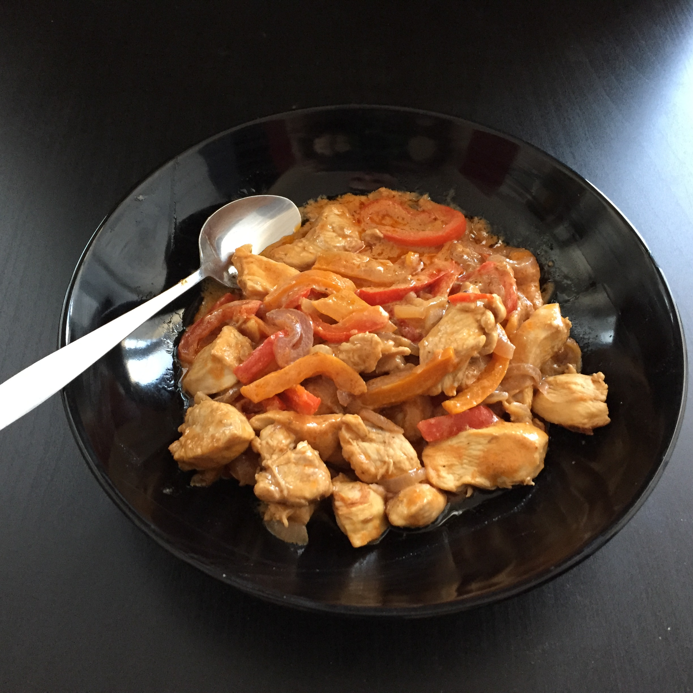

## Zutaten für 2 Portionen

- 400 g     Putenbrust
- 2         Paprika
- ½         Zwiebel
- 200 ml    Gemüsebrühe
- 1 TL      Sambal Oelek
- 2 EL      Erdnussmuß (keine Erdnussbutter)
- Öl
- evtl. noch einige Erdnüsse

## Zubereitung
Das Öl im Wok erhitzen, Paprika kleinschneiden und im Wok anbraten, dann wieder herausnehmen. Pute in Stücke schneiden, Zwiebel in Ringe und die Erdnüsse kleinhacken. Die Pute im Wok anbraten, Zwiebelringe und kleingehackte Erdnüsse dazu. Wenn alles schon etwas angebraten ist - die Zwiebeln glasig sind, Sambal Oelek und Erdnussmuß dazugeben und kurz darauf das ganze mit der Gemüsebrühe ablöschen.
Die Paprika wieder dazugeben und evtl. bei mittlerer Hitze etwas reduzieren lassen.
