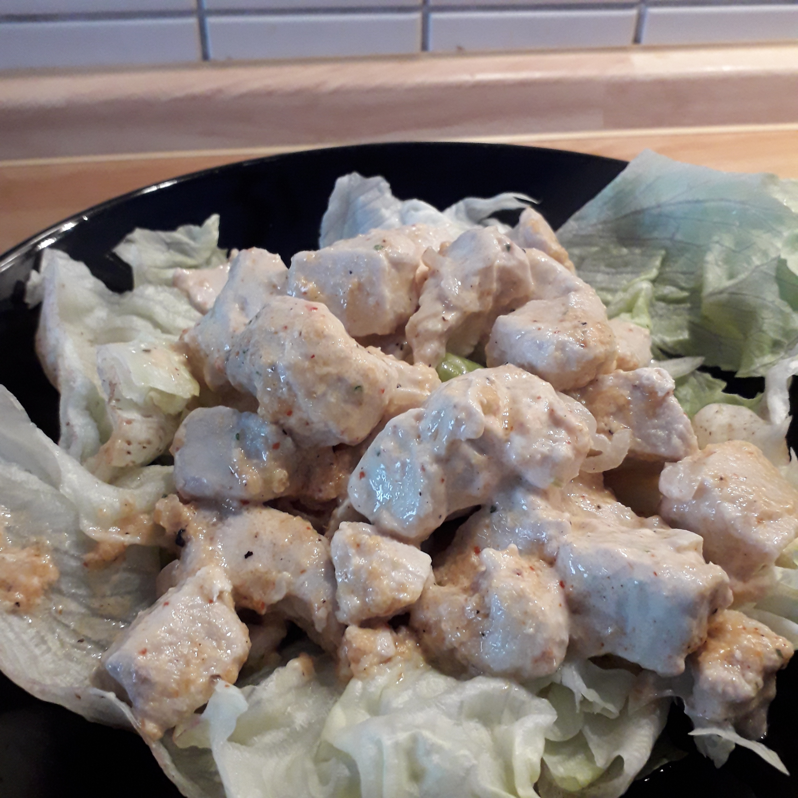

## Zutaten für 2 Portionen
- 500g  Putenbrust
- 1     Zwiebel
- 2 TL  Currypaste
- 125 g Magerquark
- 2     Knoblauchzehen
-       Pfeffer
-       Gemüsebrühe
- Öl für die Pfanne

## Zubereitung
Das Geflügel in kleine, dünne Stücke schneiden. Die Zwiebel pellen und kleinschneiden nge schneiden. Die Zwiebelwürfel zusammen mit dem Geflügel in einer Pfanne im Öl anbraten.

Währenddessen Knoblauchzehen klein hacken und zusammen mit dem Magerquark, Curry, Pfeffer und den Brühwürfel zu einer Soße verarbeiten.

Wenn das Geflügel durchgebraten ist, Herdplatte ausmachen und die Soße in die Pfanne geben und alles nochmal durchschwenken.

Dazu passt ein [/salate/gurkensalat] sehr gut.
