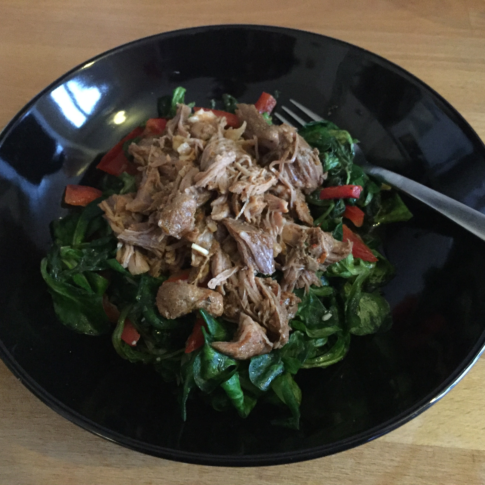

## Zutaten für 2 große Portionen
- 500 g     Pulled Turkey (1 Packung)
- 400 g     Blattspinat
- 150 g     Feldsalat
- 1         rote Paprikaschote
- 100 ml    Olivenöl
- 50 ml     Wasser
- 10        Mandeln
- 1         Knoblauchzehe
- 12        Stengel Koriander
- 6         Stengel breitblättrige Petersilie
- Stengel   Minze
- 10 g      Ingwer
- 1         Limette
- 1 TL      Salz
- 1 TL      Zucker

## Zubereitung
Pulled Turkey im Backofen zubereiten. Den Spinat nach Anleitung zubereiten und den Feldsalat kurz abspülen. Die Paprika entkernen und in lange dünne Stäbchen schneiden.

Die übrigen Zutaten mit dem Pürierstab (mit der Küchenmaschine kriegt man die Mandeln und den Ingwer nicht klein) zu einem Dressing verarbeiten.

Den Spinat und Salat abtropen lassen und zusammen mit den Paprikastäbchen und dem Dressing zuerst auf die Teller geben, darauf dann den Pulled Turkey.

## Nährwerte pro Portion
- kcal:     677
- KH:        21g
- Fett:      40g
- EW:        55g
