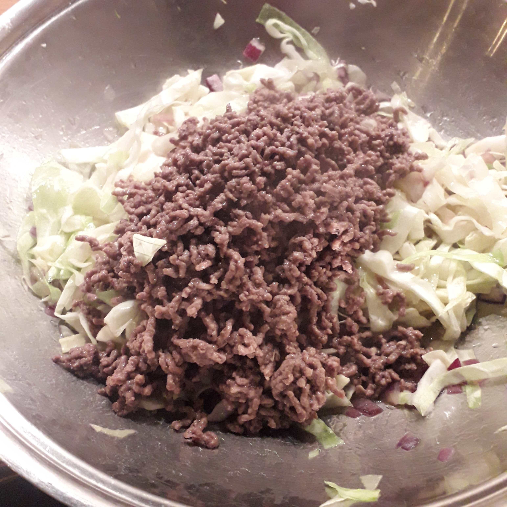

## Zutaten für 4 Portionen
- 850 g (½ Kopf) Weißkohl (alternativ: Wirsingkohl)
- 500 g Hackfleisch
- 1     große Zwiebel
- 4 EL  Olivenöl
- 40 g  Butter
- 200 ml Brühe

## Zubereitung
Weißkohl in Streifen, die Zwiebel in Würfel schneiden. Beides zusammen mit der Butter portionsweise im Wok oder Bräter anbraten. Das Hackfleisch mit Salz und Pfeffer würzen und mit dem Öl in der Pfanne anbraten. Dann alles zusammen in den Wok geben und mit der Brühe ablöschen. Bei geschlossenem Deckel noch 10 - 15 Minuten bei mittlerer Hitze köcheln lassen.
