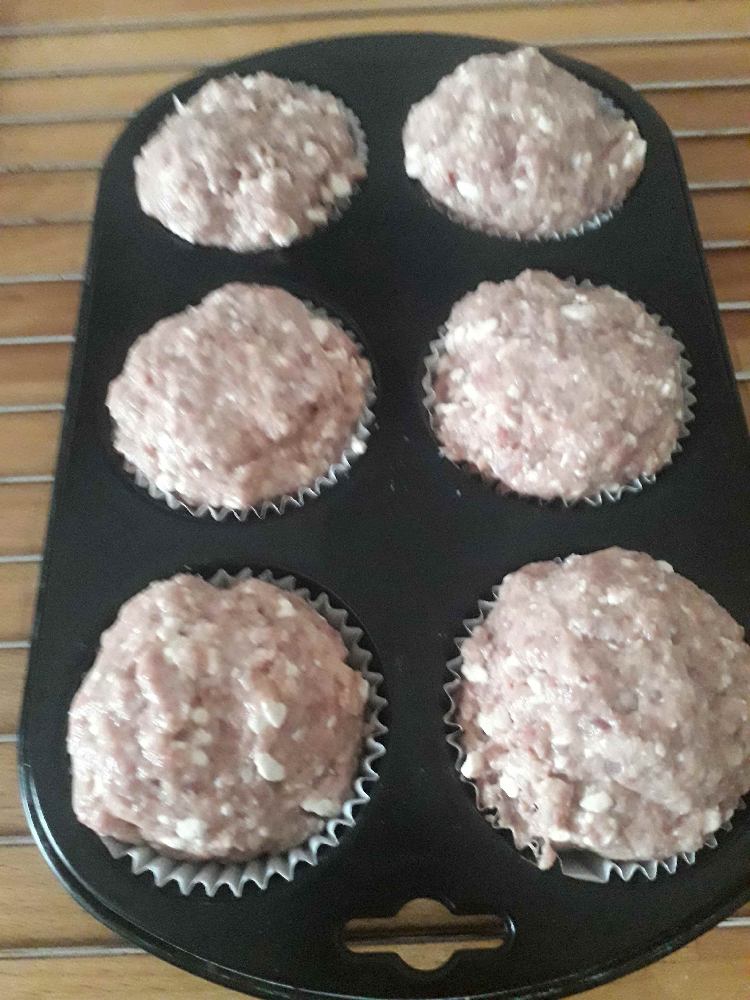

## Zutaten
- 350g Tartar
- 1 große Zwiebel
- 150g Karotten
- 3 Eiklar
- 200g Kräuterquark oder Magerquark
- Knoblauch
- Paprikapulver
- Salz

## Zubereitung
Hierfür auf jeden Fall Tartar bzw. Rinderhack nehmen, Schweinehack verliert zuviel Flüssigkeit, was im Ofen eine Sauerei gibt.
Zwiebel und Karotten sehr klein hacken (evtl. in der Küchenmaschine), alle Zutaten in eine Schüssel geben, gut durchkneten und in eine Muffinform geben, welche vorher bestenfalls eingefettet wird.
Im vorgeheizten Backofen bei 170 Grad ca. 20 Minuten backen.
