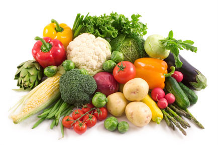

*"hier*

*sind ein*

*paar leckere Sachen*

*für die speckigen Backentaschen"*

[Hauptgerichte](/hauptgerichte/index.md)

[Salate](/salate/index.md)

[Snacks & Shakes](/snacks-und-shakes/index.md)

[Beilagen](/beilagen/index.md)

## Links
- http://www.yummly.com
- http://chefkoch.de
- http://www.oldschool-training.de/board/Forum-Rezepte
- http://www.reddit.com/r/ketorecipes
- http://www.rezeptefinden.de/s/keto.html

## APIs
- http://www.myfitnesspal.com/api
- https://wger.de/de/software/api
- http://developer.esha.com
- https://developer.nutritionix.com

## Zutaten
### Proteins
- Egg whites with one whole egg for flavor
- Beef
- Chicken
- Turkey
- Fish
- Pork
- Lamb

### Legumes
per 100g    | calories | carbs | protein | fat
------------|----------|-------|---------|------
Green beans |   21.00  |  4.25 |   1.26  | 0.37
Soybeans    |  173.00  |  9.93 |  16.64  | 8.97
Lentils     |  114.00  | 19.54 |   9.02  | 0.38
Pinto beans |  114.00  | 20.22 |   6.99  | 0.9
Kidney Beans|  121.00  | 20.80 |   8.12  | 0.93
White Beans |  114.00  | 21.20 |   7.26  | 0.29
Red beans   |  124.00  | 21.49 |   7.98  | 1.05
Black beans |  193.60  | 34.50 |  10.90  | 0.80

### Vegetables
per 100g                        | calories | carbs | protein | fat
--------------------------------|----------|-------|---------|------
Chinese cabbage (Pok Choi)      |  12.00   |  1.78 |   1.56  | 0.16
Asparagus (Gemüsespargel)       |  19.00   |  2.46 |   2.14  | 0.65
Rapini (Stängelkohl)            |  22.00   |  2.90 |   3.20  | 0.50
Wild Broccoli (Gemüsekohl)      |  22.00   |  3.00 |   3.00  | 0.00
Cauliflower                     |  17.00   |  3.16 |   1.61  | 0.22
Radish (Radieschen)             |  16.00   |  3.40 |   0.68  | 0.10
Kimchee                         |  27.00   |  3.60 |   1.80  | 0.00
Sauerkraut                      |  19.00   |  4.28 |   0.91  | 0.14
Turnip (Speiserübe)             |  20.00   |  4.36 |   1.14  | 0.23
Spinach                         |  34.00   |  4.80 |   4.01  | 0.87
Romanesco broccoli              |  25.00   |  4.99 |   2.42  | 0.25
Broccoli                        |  28.00   |  5.35 |   3.10  | 0.12
Cabbage (Weißkohl)              |  23.00   |  5.51 |   1.27  | 0.05
Kale (Grünkohl)                 |  28.00   |  5.63 |   1.90  | 0.40
Kohlrabi                        |  27.00   |  6.00 |   1.00  | 0.00
Rutabaga (Steckrübe, Kohlrübe)  |  30.00   |  6.84 |   0.93  | 0.18
Horseradish                     |  48.00   | 11.27 |   1.20  | 0.67
Peas (Erbsen)                   |  78.00   | 14.26 |   5.15  | 0.28

*last updated: Wed Jun 17 00:37:14 CEST 2015*
