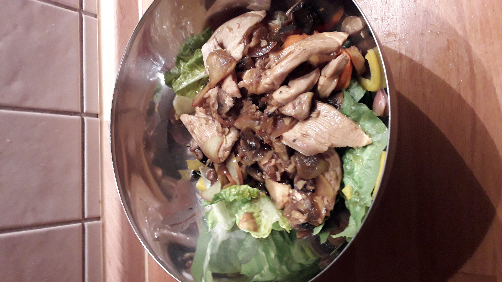

## Zutaten für 2 Personen
- 150g Blattsalat
- 1 gelbe Paprikaschote
- 1 Karotte
- 150 g Champignons
- 1 großer Apfel
- 400 g Hühnchenbrust
- 1 Knoblauchzehe
- 6cm Ingwer
- 7 EL Olivenöl
- 3 EL Sojasauce
- ½ TL Sambal Oelek
- 6 EL Hühnerbrühe
- Salz & Pfeffer
- 1 EL Essig

## Zubereitung
1. Salat zerpflücken, waschen, trockenschleudern und in mundgerechte Stücke zupfen
2. Paprikaschote entkernen und in feine Streifen schneiden
3. Karotte schälen und in dünne Scheiben schneiden
4. Salat, Paprika und Karottenscheiben auf Tellern anrichten
5. Champignons putzen und vierteln
7. Apfel waschen, vierteln, entkernen und in feine Spalten schneiden
6. Fleisch in dünne Scheiben schneiden
8. Knoblauch schälen und kleinhacken
9. Ingwer schälen und kleinhacken
10. 3 EL Öl in einer Pfanne erhitzen, Fleisch scharf anbraten
11. Apfel und Pilze hinzugeben, 3 Minuten braten
12. Ingwer und Knoblauch hinzugeben, Sojasauce, Sambal Oelek und Brühe unterrühren, mit Salz und Pfeffer abschmecken
13. bei mittlerer Hitze für 4 Minuten köcheln lassen
14. Essig und restliches Öl unterrühren und über den Salat geben

