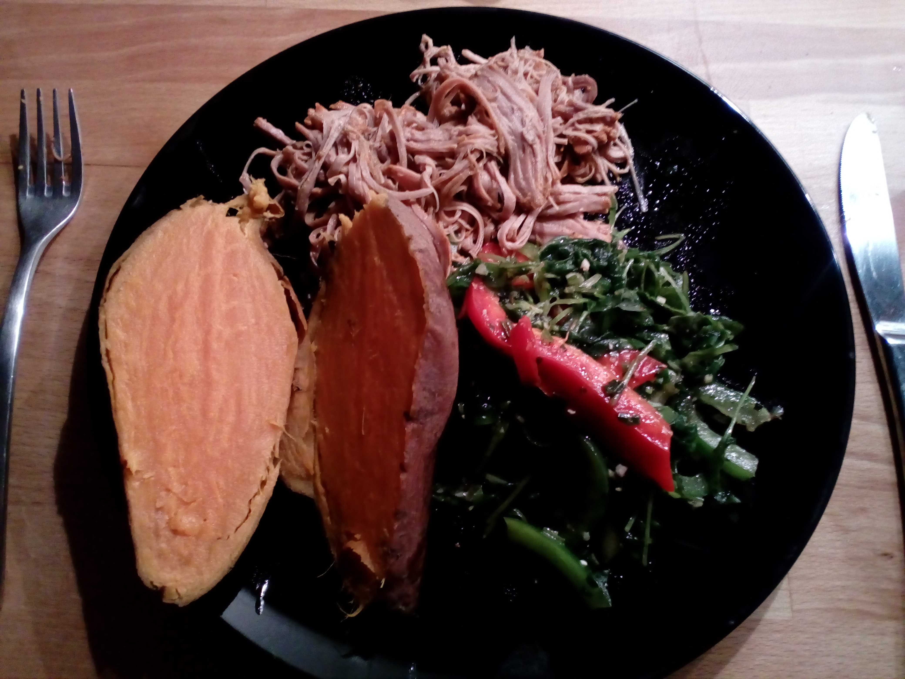
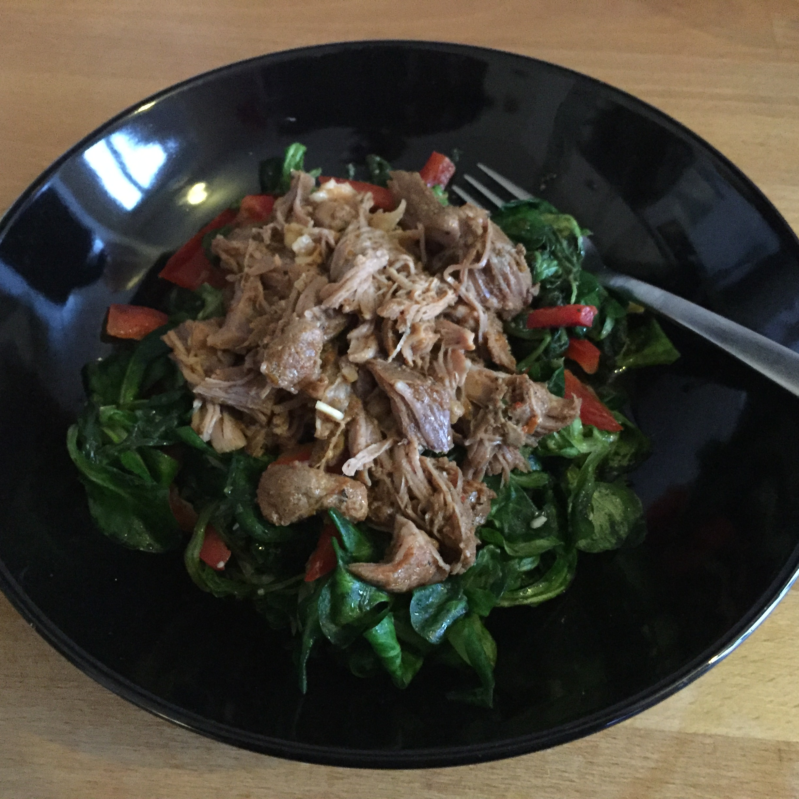

## Zutaten für 4 Portionen

### Für den Salat:
- 300 g     Blattspinat
- 150 g     Feldsalat
- 3         grüne Paprikaschoten

### Dressing:
- 100 ml    Olivenöl
- 50 ml     Wasser
- 10        Mandeln (gestiftet oder gehobelt)
- 1         Knoblauchzehe
- 12        Stengel Koriander
- 6         Stengel breitblättrige Petersilie
- 6         Stengel Minze
- 10 g      Ingwer
- Saft und Schale von 1 Limette
- 1 TL      Salz
- 1 TL      Zucker

## Zubereitung
Spinat und Salat abspülen und gut abtropfen lassen.

Die Zutaten für das Dressing mit einem Pürierstab zu einer Marinade verrühren.

Die grünen Paprikaschoten entkernen, in lange dünne Stäbchen schneiden und mit dem Salat und dem Dressing vermengen.

Passt sehr gut zu Pulled Turkey.
