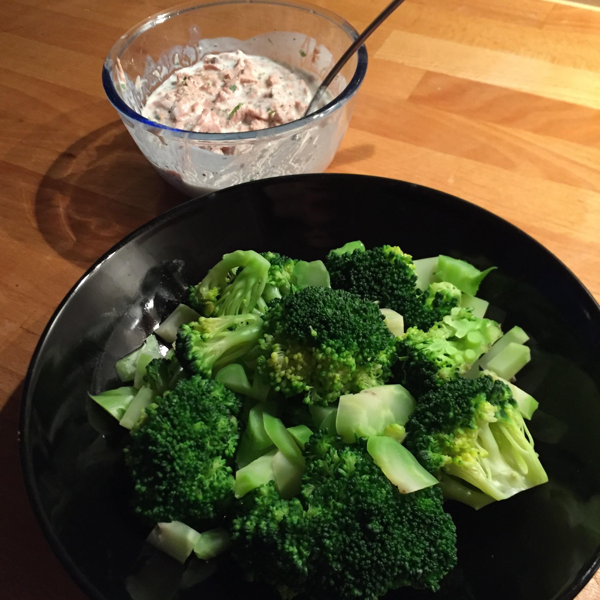

## Zutaten
* Eine Hand voll Broccoli
* Eine Dose Thunfisch Naturell ohne Öl
* Kleiner Becher Joghurt
* Salz, Pfeffer

## Zubereitung
Den Broccoli verzehrfertig kochen, danach abkühlen lassen.
Joghurt, Salz und Pfeffer je nach Geschmack, vermengen.
Thunfisch Naturell abtropfen und in die Sauce unterheben.
Sauce über den abgekühlten Broccoli geben - fertig.

