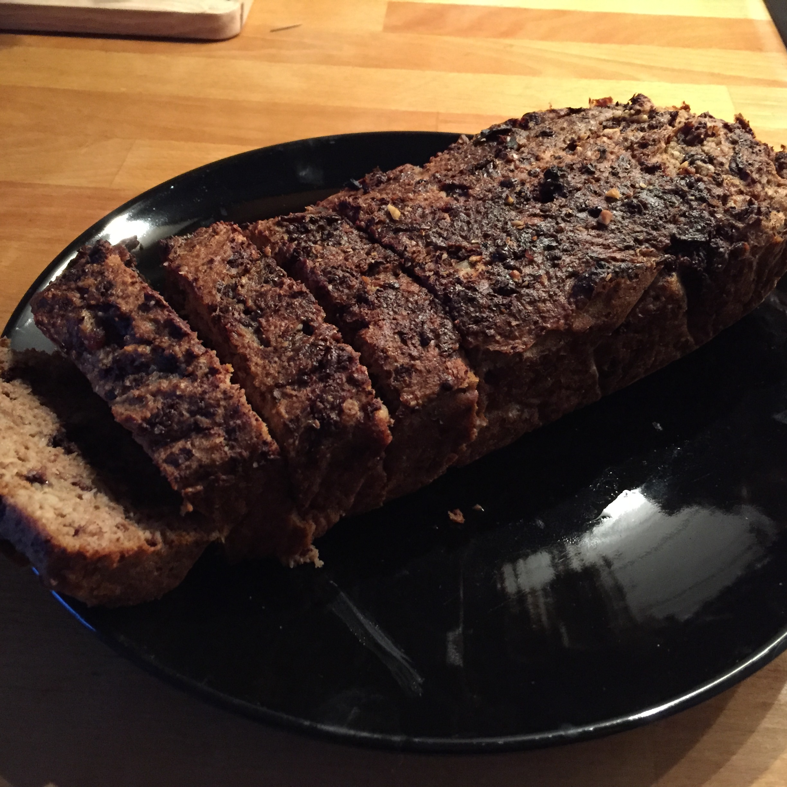

## Zutaten
- 100 g     Butter
- 2         Bananen
- 100 ml    Kokosmilch
- 4         Eier
- 3         Datteln
- 1 EL      gemahlener Zimt
- 1 TL      gemahlener Kardamom
- 1 TL      Vanillepulver
- 1 TL      Backpulver
- 6 TL      Flohsamenschalen
- 100 g     Kokosraspel
- 100 g     Walnüsse
- 100 g     dunkle Schokolade

## Zubereitung

Die Walnüsse und Schokolade grob hacken. Die Butter bei niedriger Temperatur in einem Topf zum Schmelzen bringen. Bananen, Kokosmilch, Eier und Datteln in der Küchenmaschine oder mit dem Pürierstab mixen und in eine Schüssel geben. Die geschmolzene Butter, den Zimt, Kardamom, Vanillepulver, Flohsamenschalen, Kokosraspel und Backpulver hinzufügen und gut verrühren. Die gehackten Walnüsse und die Schokolade unterheben und den Teig für 10 Minuten ruhen lassen.

Inzwischen den Backofen auif 200 ℃ vorheizen und eine Kastenform mit Backpapier auslegen.
Den Teig dann in die Kastenform füllen und 30 Minuten backen.

## Nährwerte pro Kuchen
- kcal: 3592
- KH:    129g
- Fett:  307g
- EW:     71g
