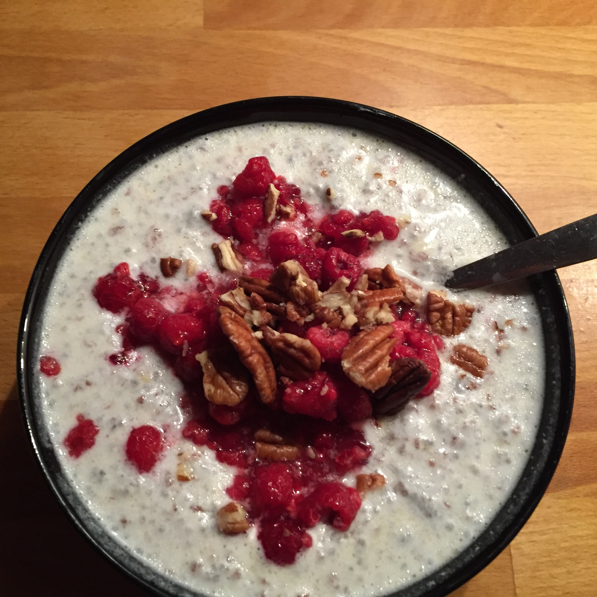

## Zutaten
- 3 EL      Leinsamen (~ 23 g)
- 3 EL      Chiasamen, (~ 23 g)
- 300 ml    Mandel- oder Kokosmilch
- 1 EL      Ghee oder Kokosfett (~ 11 g)
- 100 g     Himbeeren (oder andere Waldbeeren)
- 12 g      Paranusskerne
- evtl. etwas Stevia

## Zubereitung
Die Lein- und Chiasamen zusammen mit dem Großteil (9/10) Mandel- oder Kokosmilch vermischen, damit sie schon mal ein bisschen aufquellen können.
Das Kokosfett bsw. Ghee bei mittlerer Hitze in einer beschichteten Pfanne zerlassen und die Flüssigkeit hineingeben. Mit einem Spatel 3 Minuten lang rühren, bis eine puddingartige Masse entstanden ist.
Vom Herd nehmen und in eine Schüssel gießen, den Rest der Mandel- oder Kokosmilch nach Belieben mit Stevia süßen und die Beeren sowie die grob gehackten Paranusskerne darübergeben.
(Ich hab für das Foto leider bisschen zuviel von der Mandelmilch genommen, aber 300ml sollten in etwa passen(

## Nährwerte
- kcal:     539
- KH:         9
- Fett:      44
- EW:        16
