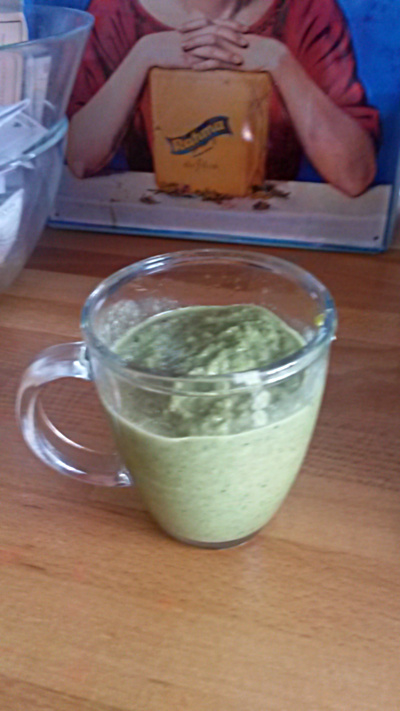

## Zutaten

-    50.00 g, Brokkoli (Roh)
-    50.00 g, Grünkohl
-    0.50 Avocado
-    10.00 g, Petersilie
-    1.00 mittelgroß (150g), Apfel Jonagold (Mittelgroß)
-    40.00 g, Staudensellerie
-    10.00 g, Ingwer
-    80.00 g, Apfelsine/orange
-    100.00 g, Zucchini

## Zubereitung

Zuerst Brokkoli, Grünkohl, Avocado  und Petersilie mit einem Pürierstab zerkleinern. Den Apfel entkernen, den Ingwer und die Zucchini schälen. Die Apfelsine auspressen und den Saft zusammen mit den anderen Zutaten in pürieren, bis eine konsistente Masse entsteht. Eventuell noch etwas Wasser nachkippen.
