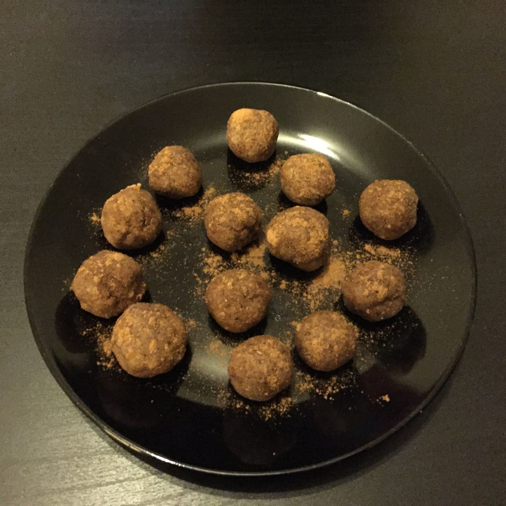

## Zutaten
- 100 g           Mandelmehl
- 2 EL, gehäuft   Mandelmus (~ 45g)
- 1 EL, gehäuft   Süßstoff (Erythrit oder Stevia)
- 3 EL            Wasser

## Zubereitung
Das Mandelmehl mit dem Süßstoff mischen, das Wasser und Mandelmus dazugeben und alles gut miteinander verrühren. Mit angefeuchteten Händen aus der Masse Kugeln formen. Ergibt ~ 10-12 Stück. Evtl. noch 5 min. bei 200 C Umluft im Ofen noch kurz anbacken.
Im Kühlschrank aufbewahren.

## Nährwerte pro Praline
- kcal: 75
- KH:    1g
- EW:    3g
- Fett:  6g

