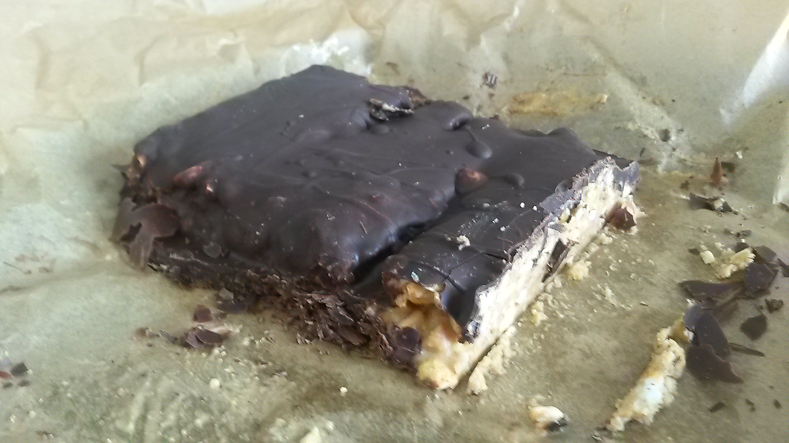

## Zutaten

- 100 g     gesalzene Erdnüsse
- 100 g     ungesalzene Erdnüsse
- 200 g     stückige Erdnussbutter ohne Zuckerzusatz
- 25 g      Butter
- 2 EL      Stevia oder ähnlicher Süßstoff in Pulverform
- 1 Msp.    Vanillepulver
- 200 g     dunkle Schokolade (min. 80% Kakaoanteil)
- 1 EL      Kokosöl

## Zubereitung
Die Nüsse grob hacken. Erdnussbutter in einem Topf schmelzen, Butter, die gehackten Nüsse, den Süßstoff und die Vanille hinzufügen und gut vermischen.
Eine Kastenform mit Frischhaltefolie auslegen, die Masse hineinfüllen und im Gefrierschrank kalt stellen, bis sie schnittfest ist. Die Masse mit einem scharfen Messer in Riegel schneiden und auf einem Teller mit Backpapier ausbreiten.
Die Schokolade mit Kokosöl in einem Wasserbad schmelzen und die geschmolzene Schokolade mit einem Glasierpinsel auf die Riegel auftragen. Alternativ kann man die Riegel auch vorsichtig mit zwei Gabeln in die flüssige Schokolade tauchen.
Das ganze dann vor dem Servieren im Kühlschrank abkühlen lassen.
