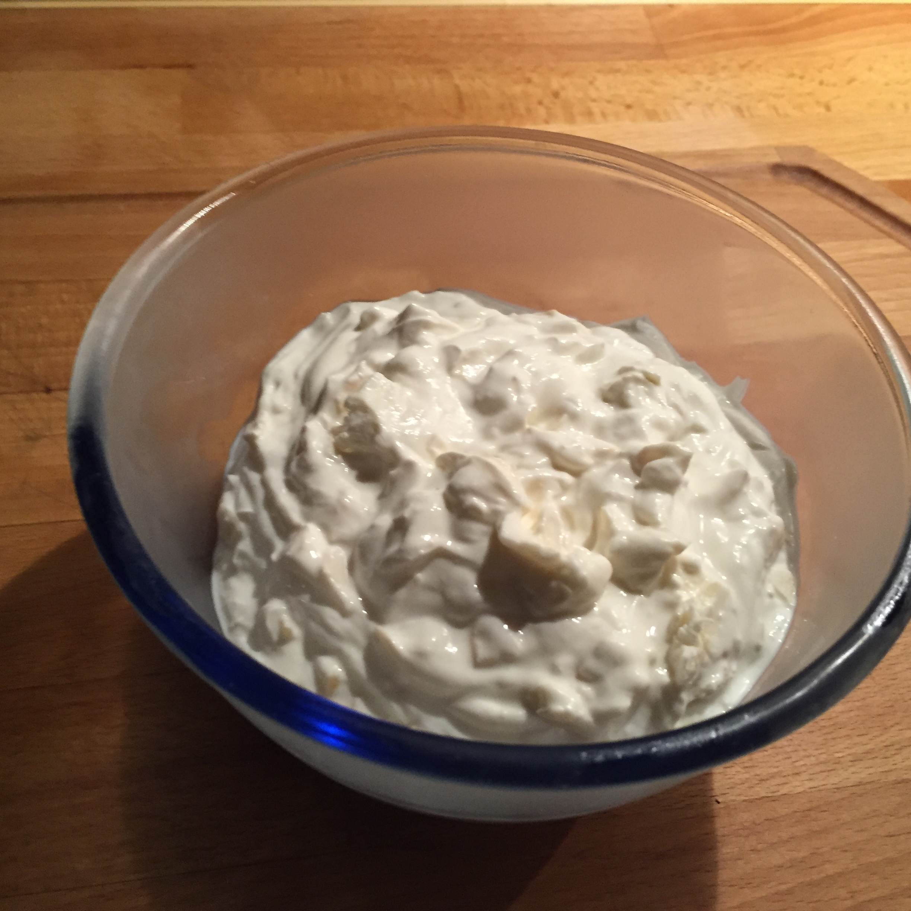

## Zutaten für 4 Portionen

- 500 g     Magerquark
- 250 g     Jogurt
- 250 g     Sauerrahm (10 oder 15% Fett)
- 100 g     Mandelsplitter
- 5 g       Stevia
- zusätzlich n.B. Mandelmuß / Mandelmehl / Mandelaroma

## Zubereitung
Denkbar einfach: alles vermengen und kalt stellen.

## Nährwerte pro Portion
- kcal:   405
- KH:      10 g
- EW:      25 g
- Fett:    29 g
