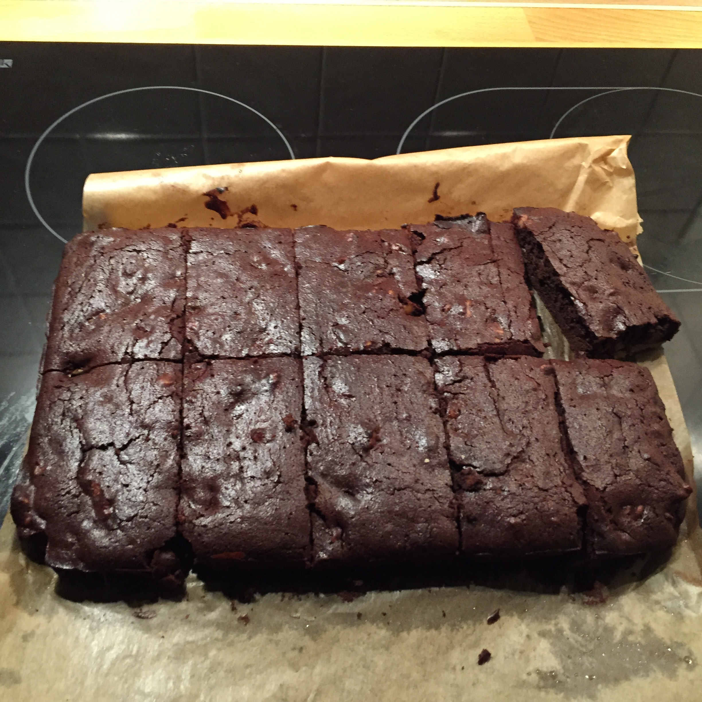

## Zutaten für 10 Brownies
- 175g  weiche, gesalzene Butter (oder eben ungesalzene Butter mit 2 TL Salz)
- 80g   Kokosblütenzucker
- 2 EL  Steviapulver
- 200g  dunkle Schokolade (~80% Kakaoanteil)
- 6     Eier
- 150g  Walnüsse oder Paranüsse
- 1 TL  gemahlener Zimt
- 25g   gemahlener Kaffee

## Zubereitung
Die Schokolade im Wasserbad oder in einem kleinen Topf bei niedriger Hitze zum Schmelzen bringen.
Währenddessen Butter, Kokoszucker und Steviapulver in einer Schüssel mit einem Rührgerät mischen. Sollte die Butter zu hart sein, einfach für ~30 Sekunden auf niedriger Stufe in der Mikrowelle erhitzen. Dann die geschmolzene Schokolade hinzugeben.
Die Eier trennen und das Eigelb zusammen mit dem Zimt und dem Kaffee in den "Teig" einrühren.

Jetzt kann schon mal der Backofen auf 180 ℃  vorgeheizt werden und eine Springform oder eine andere ofenfeste Form mit Backpapier ausgelegt oder eingefettet werden.
Die Quirle des Rührgerätes abspülen, so dass sie fettfrei sind, damit das Eiweiss steif schlagen und vorsichtig dem Teig unterheben.

Zum Schluss die Nüsse grob hacken und ebenfalls in den Teig unterrühren.
Das ganze kommt dann für 20 min. in den Backofen.

## Nährwerte pro Brownie
- kcal: 411
- KH:    14g
- EW:     9g
- Fett:  36g
